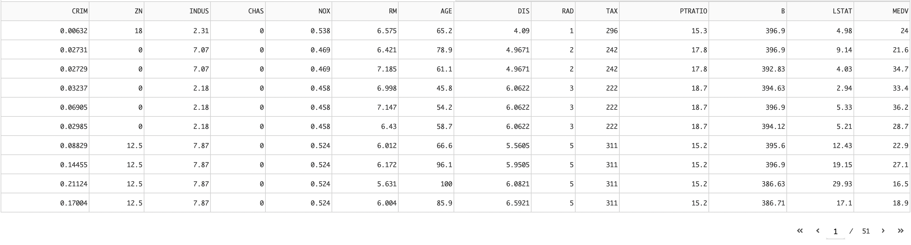
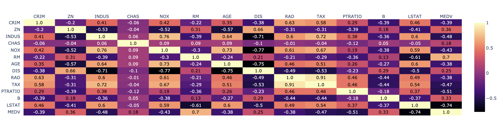

## Dash Dataset View Tools
This tool supports exploratory data analysis based on CSV data.
### Components
- Data preview
- Correlation matrix

#### Data preview
using [Dash DataTable](https://dash.plotly.com/datatable)

#### Correlation matrix
using [Plotly Annotated Heatmap](https://plotly.com/python/annotated-heatmap/)
this library make display data in cells and column names can be written on both axes.
